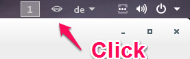
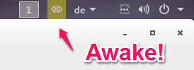

# Gnome shell extension *Keep Awake* #

Keep your computer be awake! Prevent your computer from activating the screensaver, turning off your screen or suspending when it is idle for a while. One click disables screensaver/suspend. Click once more to make the change persistant between restarts (indicated by a small lock in the indicator icon). Click again to reenable screensavers and suspension.

This extension can be helpful when you give a presentation or are watching a video or are reading a document for a while or any else where your computer should be keep awake.

## Installation ##

1. Drop the `KeepAwake@jepfa.de` folder and its contents into `~/.local/share/gnome-shell/extensions/`.  
	One way to do this is as follows:
	
	
	```bash
	mkdir git
	cd git
	git clone https://github.com/jenspfahl/KeepAwake.git
	mkdir -p ~/.local/share/gnome-shell/extensions
	cp -r KeepAwake/KeepAwake@jepfa.de ~/.local/share/gnome-shell/extensions/
	```
	You can do `ln -s` instead of `cp -r` if you prefer.
	
2. Restart gnome shell: Press <kbd>Alt</kbd>+<kbd>F2</kbd>, type <kbd>r</kbd>, press <kbd>Enter</kbd>.  
   If that doesn't work (e.g. on Wayland): log out -> log in
   
3. Install/Run `gnome-tweak-tool` (restart it if it was already running)
4. Go to Extensions and activate KeepAwake.

## Usage ##

When you have configured some screensaver or "sleep" powersaving settings, the icon looks like this. 


Toggle it to deactivate all screensaver and powersaving settings. (A small lock icon indicates the setting is persistant between restarts.)



Now you can watch videos absolutely undisturbed!

## Interna ##
 
This extension toggle following Gnome Settings:
 
 
From `org.gnome.settings-daemon.plugins.power`:
 
* `idle-dim`: Time during dimm the screen when idle
* `sleep-inactive-ac-type`: Suspend when idle and power cable is plugged
* `sleep-inactive-battery-type`: Suspend when idle and power cable is unplugged (battery mode)
 
 
From `org.gnome.desktop.session`:
 
* `idle-delay`: Time during turn off the screen when idle
 
From `org.gnome.desktop.screensaver`:
 
* `idle-activation-enabled`: Activate screensaver when idle

If you wish to toggle some more settings, please contact me or create a pull request.
